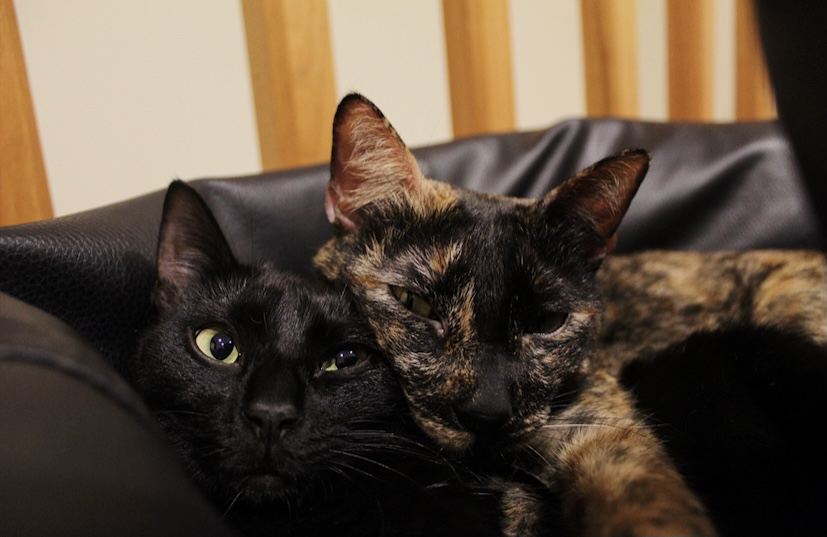

# Título Principal

Este é um parágrafo simples com **negrito** e *itálico*.

Este é outro parágrafo simples com ambos ***negrito e italico***.

## Subtítulo

###### Até ao sexto nível

Uma lista numerada:

1. Item 1
2. Item 2
3. Item 3

Um link de um [Vídeo](https://www.youtube.com/watch?v=dQw4w9WgXcQ&ab_channel=RickAstley).

Um exemplo de um link mal escrito em MD: texto plano [] texto a nao capturar [página [text]() da UC](http://www.uc.pt)

Uma imagem:

Uma lista numerada no final do ficheiro:
1. Item 1
2. Item 2
3. Item 3